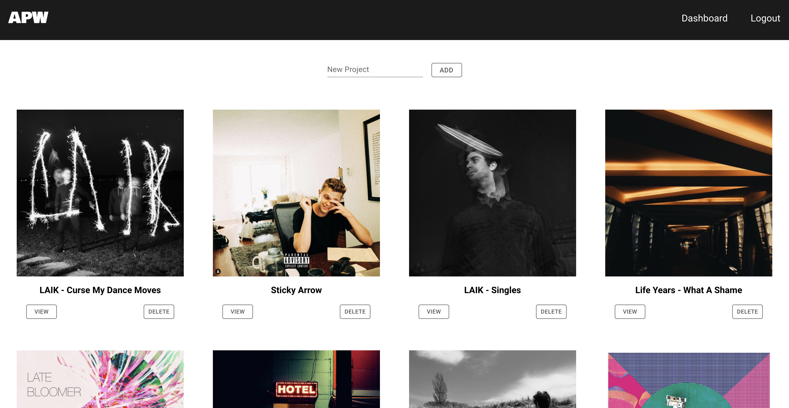
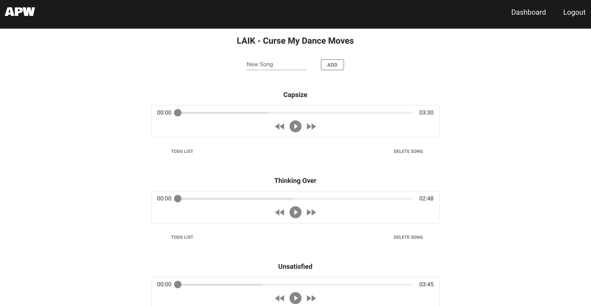
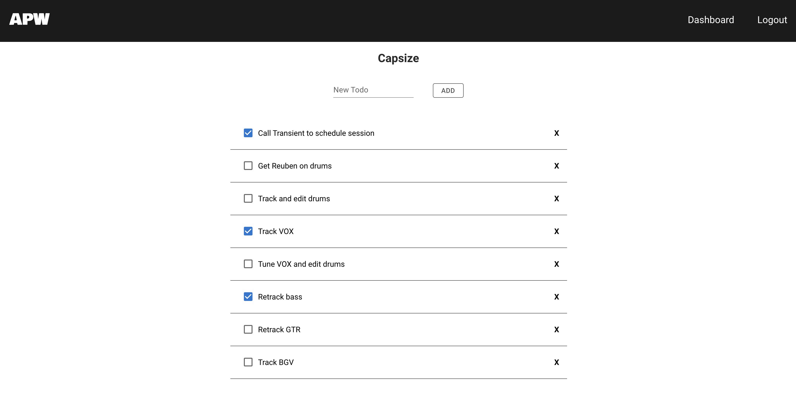

# Audio Project Workspace

APW is a full CRUD application with authorization that allows users to keep track of their audio projects.  Users can upload images for the project and mp3s for the songs within those projects.  The user can also add todo lists for each song within the projects to keep track of what needs to be done to finish the album.  The frontend of this application was done in React.js and the backend was done with Node.js, Express and Mongoose.

# Technologies Used

- React
- Firebase
- Node.js
- Express
- JavaScript
- jQuery
- CSS
- SASS
- Mongodb
- EJS

# Screenshots

# Getting Started

[Click here](https://apw-app-4.netlify.app) to see the deployed project

# Future Enhancements
- Allow users to share their personal projects with other team/bandmates to collaberate
- Add a two step process for deleting anything in case the user deletes a project by mistake
- Allow the user to replace audio and image files after upload
- Create an edit route for the list items so that they can be edited after creation
- Allow users to reange the order of projects, songs, and list items
